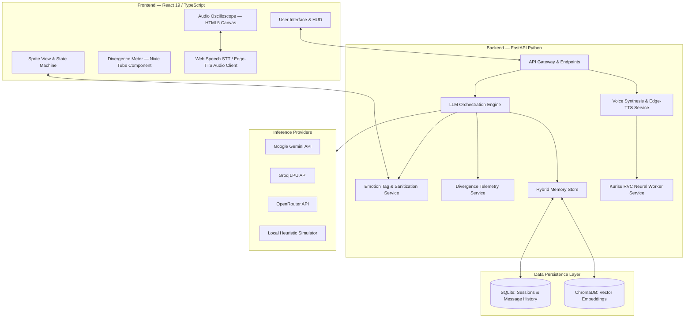

# Amadeus

A full-stack, multimodal conversational AI application featuring interactive sprite animations, audio-reactive procedural lip-sync, acoustic waveform visualization, local Retrieval-Augmented Generation (RAG), and multi-provider LLM orchestration.

[](https://www.gnu.org/licenses/gpl-3.0)
[](https://www.typescriptlang.org/)
[](https://react.dev/)
[](https://fastapi.tiangolo.com/)
[](https://www.python.org/)
[](https://vitejs.dev/)
[](https://tailwindcss.com/)
[](https://www.trychroma.com/)
[](https://www.sqlite.org/)

---

## Overview

**Amadeus** is a real-time conversational agent interface inspired by the fictional Amadeus system from *Steins;Gate 0*. The system reproduces the persona of character Makise Kurisu using strict natural language system directives, semantic memory retrieval, and synchronized audiovisual rendering.

Unlike standard text-based chat interfaces, Amadeus integrates:
- **Visual State Machine**: 174 high-resolution visual novel sprite assets synchronized with LLM sentiment metadata.
- **Procedural Lip-Sync & Blinking**: Audio-reactive mouth movement and stochastic eye-blink cycles.
- **Acoustic Waveform Visualization**: Real-time sine wave rendering on an HTML5 Canvas matching speech synthesis output.
- **Hybrid RAG Memory Architecture**: Vector similarity search (ChromaDB) combined with relational session persistence (SQLite).
- **Multi-Provider LLM Orchestration**: Fault-tolerant routing across Google Gemini, Groq (LPU), OpenRouter, and a deterministic local offline simulator.

---

## System Architecture



---

## Key Features

### 1. Sprite Rendering & Procedural Lip-Sync
- **13 Emotional States**: Maps semantic output tags (`<!--emotion:xxx-->`) dynamically to sprite states: `neutral`, `smile`, `happy`, `serious`, `annoyed`, `surprised`, `tsundere`, `thinking`, `smug`, `flustered`, `sad`, `puzzled`, and `desperate`.
- **Stochastic Blinking Cycle**: Autonomous timer triggering eye blinks at pseudo-random intervals (3.5s to 6.0s) with 130ms frame duration.
- **Audio-Reactive Lip-Sync**: Listens to speech synthesis playback events and toggles mouth frames procedurally to match spoken phonemes.
- **Asset Preloading**: Preloads 174 PNG sprite frames in memory on startup to guarantee zero-latency expression transitions.

### 2. Hybrid RAG & Context Management
- **ChromaDB Vector Store**: Indexes canonical persona facts, user-shared information, and few-shot dialogue exemplars for cosine similarity search.
- **SQLite Relational Store**: Persists chat sessions, full message logs, timestamps, emotion tags, and recalled memory associations.
- **Dynamic Context Injection**: Combines active system directives, top-k semantically recalled memories ($k=6$), few-shot dialogue exemplars, and real-time worldline divergence telemetry into the prompt payload.

### 3. LLM Orchestration & Anti-Repetition Pipeline
- **Provider Support**:
  - **Google Gemini**: Official REST API integration supporting `gemini-2.5-flash` and `gemini-1.5-flash` with candidate fallback routing.
  - **Groq**: Ultra-low-latency LPU inference via OpenAI-compatible endpoints (`llama-3.3-70b-versatile`).
  - **OpenRouter**: Open-model routing (`meta-llama/llama-3.3-70b-instruct:free`).
  - **Offline Simulator**: Rule-based fallback providing deterministic responses without external network requests.
- **Anti-Repetition & Sanitization**:
  - Active `presence_penalty` and `frequency_penalty` (0.4) applied across providers.
  - History prefix sanitization breaks probabilistic echo loops from previous chat turns.
  - Real-time output regex filter strips repetitive verbal tics before TTS and UI rendering.

### 4. Neural Voice Synthesis & Kurisu RVC Voice Cloning
- **Dual-Stage Speech Pipeline**: Generates clean base phonetic audio in Portuguese using Microsoft Edge-TTS (`pt-BR-FranciscaNeural` / `pt-BR-ThalitaNeural`) and routes it through a neural voice conversion pipeline.
- **Dedicated Kurisu RVC Worker**: High-fidelity Retrieval-based Voice Conversion using RMVPE pitch extraction and HuBERT semantic audio representations, transforming speech into Makise Kurisu's canonical voice.
- **Acoustic Controls & Fine-Tuning**: Real-time pitch transposition (-12 to +12 semitones) and Faiss feature index retrieval ratio sliders in the UI.
- **Fault-Tolerant Fallback**: Gracefully falls back to direct neural Edge-TTS or the browser Web Speech API if the RVC worker is unavailable.

---

## Project Structure

```text
amadeus/
├── public/                          # Static web assets
│   ├── amadeus-icon.svg             # Application logo
│   └── assets/sprites/kurisu/       # 174 visual novel character sprites
├── server/                          # Python FastAPI backend
│   ├── app/
│   │   ├── api/v1/endpoints/        # REST endpoints (chat, memories, sessions, divergence)
│   │   ├── core/                    # App configuration, environment, and lifespan
│   │   ├── db/                      # Persistence layer (MemoryStore: SQLite + ChromaDB)
│   │   ├── schemas/                 # Pydantic request/response models
│   │   └── services/                # Business logic, emotion parsing, and LLM orchestrator
│   ├── data/                        # Local databases (amadeus.db and chroma_db)
│   ├── personas/                    # Persona profiles and system prompts (JSON)
│   ├── tests/                       # Automated unit and integration test suite
│   ├── training/                    # Fine-tuning datasets and dialogue exemplars
│   ├── main.py                      # ASGI server entry point
│   └── requirements.txt             # Python backend dependencies
├── src/                             # React frontend (TypeScript + Vite)
│   ├── components/                  # UI components (SpriteView, Oscilloscope, HUD, Modals)
│   ├── data/personas/               # Client-side persona definitions and prompts
│   ├── services/                    # API clients, audio services, and sprite catalog
│   ├── types/                       # Shared TypeScript interface definitions
│   ├── App.tsx                      # Root component and state orchestrator
│   └── main.tsx                     # React application entry point
├── package.json                     # Node.js project metadata and dependencies
├── tailwind.config.js               # Tailwind CSS theme configuration
├── tsconfig.json                    # TypeScript compiler configuration
└── vite.config.ts                   # Vite bundler configuration
```

---

## Getting Started

### Prerequisites
- **Node.js**: v18.0.0 or later (v20+ recommended)
- **Python**: 3.10 or later (tested on 3.10 through 3.14)
- **Browser**: Google Chrome, Microsoft Edge, or Chromium-based browsers (for Web Speech API support)

---

### Frontend Setup

1. Clone the repository:
   ```bash
   git clone https://github.com/lucca3447/amadeus.git
   cd amadeus
   ```

2. Install dependencies:
   ```bash
   npm install
   ```

3. Start the development server:
   ```bash
   npm run dev
   ```

The frontend will be available at `http://localhost:5173`.

---

### Backend Setup

1. Navigate to the `server` directory:
   ```bash
   cd server
   ```

2. Create and activate a Python virtual environment:
   ```bash
   # Windows (PowerShell):
   python -m venv venv
   .\venv\Scripts\Activate.ps1

   # Linux / macOS:
   python3 -m venv venv
   source venv/bin/activate
   ```

3. Install backend dependencies:
   ```bash
   pip install -r requirements.txt
   ```

4. Start the backend server:
   ```bash
   uvicorn main:app --reload --port 8000
   ```

Interactive OpenAPI documentation will be accessible at `http://localhost:8000/docs`.

---

## API Configuration

API keys can be configured directly through the in-app **Settings Modal (⚙️)** in the top-right corner. Keys are stored client-side in `localStorage` and sent with user requests:

| Provider | Key Format | Default Model | API Dashboard |
| :--- | :--- | :--- | :--- |
| **Google AI Studio** | `AIzaSy...` | `gemini-2.5-flash` | [aistudio.google.com](https://aistudio.google.com/) |
| **Groq** | `gsk_...` | `llama-3.3-70b-versatile` | [console.groq.com](https://console.groq.com/) |
| **OpenRouter** | `sk-or-...` | `meta-llama/llama-3.3-70b-instruct:free` | [openrouter.ai](https://openrouter.ai/) |
| **Offline Mode** | *None* | Local Heuristic Simulator | *No key required* |

---

## REST API Reference

The backend provides a versioned RESTful API (`/api/v1` with backward-compatible `/api` routing):

| Method | Endpoint | Description |
| :--- | :--- | :--- |
| `GET` | `/api/health` | Health check returning status, system uptime, and memory/session counts |
| `POST` | `/api/chat` | Main conversational endpoint running RAG retrieval and LLM orchestration |
| `GET` | `/api/personas/{id}` | Retrieves persona metadata, system prompt, and canonical memories |
| `GET` | `/api/memories` | Lists all indexed memories from SQLite and ChromaDB |
| `POST` | `/api/memories` | Adds a new memory item (persists to SQLite and vectorizes in ChromaDB) |
| `DELETE` | `/api/memories/{id}` | Deletes a memory item by ID from both stores |
| `GET` | `/api/sessions` | Lists conversation session history |
| `POST` | `/api/sessions/new` | Creates a new conversation session |
| `GET` | `/api/sessions/{id}/messages` | Retrieves message history for a given session |
| `GET` | `/api/divergence` | Returns live worldline divergence measurement and attractor field classification |
| `POST` | `/api/tts` | Synthesizes text to speech with Edge-TTS and optional Kurisu RVC neural voice conversion |

---

## Testing & Quality Assurance

### Backend Test Suite (Pytest)
Run the automated test suite from the repository root or the `server` directory:

```bash
pytest server/tests
```

The 13-test suite verifies:
- API endpoint health and routing backward compatibility
- Full session lifecycle and message persistence
- Semantic memory CRUD operations (SQLite + ChromaDB)
- Emotional tag parsing and rule-based sentiment triggers
- Anti-repetition sanitization and catchphrase suppression
- Canonical physical appearance validation

### Frontend Type-Checking (TypeScript)
Validate TypeScript compilation without emitting files:

```bash
npx tsc --noEmit
```

---

## Security & Privacy

- **Client-Side Secret Storage**: API keys are stored exclusively in the user's browser `localStorage`. No keys are sent to third parties other than the selected inference provider.
- **Local Data Isolation**: Backend session logs and vector embeddings are stored locally in `server/data/` (`amadeus.db` and `chroma_db/`).
- **Input & Output Sanitization**: Dialogue inputs and outputs are filtered against chain-of-thought scratchpad leaks and formatting artifacts.

---

##  Credits

Credits the creators, open-source communities, and researchers whose tools, models, and datasets used in this project:

- **Kurisu RVC Voice Model**:
  - Pre-trained RVC model weights and feature retrieval index (`Kurisu-RVC`) created by [Francesco Caracciolo](https://github.com/FrancescoCaracciolo), hosted on [Hugging Face (`FrancescoCaracciolo/Kurisu-RVC`)](https://huggingface.co/FrancescoCaracciolo/Kurisu-RVC).
  - Derived from the official character voice acting performance of **Asami Imai (今井 麻美)** as Makise Kurisu.
- **Steins;Gate Corpus & Scenario References**:
  - Dialogue extractions, canonical scenarios, and persona system prompts adapted from [Francesco Caracciolo's Amadeus Project](https://github.com/FrancescoCaracciolo/Amadeus) 
- **Retrieval-based Voice Conversion (RVC)**:
  - Voice conversion architecture and feature retrieval algorithms built upon [Retrieval-based-Voice-Conversion-WebUI (RVC-Project)](https://github.com/RVC-Project/Retrieval-based-Voice-Conversion-WebUI), incorporating **RMVPE** for high-precision fundamental frequency ($F_0$) pitch tracking and **HuBERT / ContentVec** for speaker-invariant acoustic representations.
- **Neural Text-to-Speech (Edge-TTS)**:
  - Python interface and Microsoft Edge neural speech synthesis bridge provided by the open-source library [rany2/edge-tts](https://github.com/rany2/edge-tts).
- **Character Design & Visual Novel Assets**:
  - Original character design and illustrations by **huke**.
  - Visual novel sprite assets, storyline, and concepts from *Steins;Gate* and *Steins;Gate 0* by **MAGES. Inc. / 5pb. / Chiyomaru Shikura / Nitroplus**.

---

## Disclaimer & Intellectual Property

- *Steins;Gate*, *Steins;Gate 0*, the character **Makise Kurisu**, related concepts, names, and visual novel assets are the intellectual property of **MAGES. Inc. / 5pb. / Chiyomaru Shikura**.
- This project is an independent, non-commercial open-source software project developed for educational, research, and non-profit experimentation purposes under Fair Use.
- Software is provided under the [GNU General Public License v3](LICENSE) "as is", without warranty of any kind.
