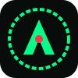
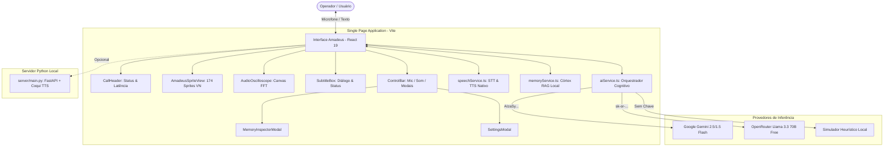

<div align="center">

# 🧠 AMADEUS SYSTEM // STEINS;GATE 0
### *Autonomous Human Memory Digitalization & Neurological Reproduction Interface*

[](https://opensource.org/licenses/MIT)
[](https://www.typescriptlang.org/)
[](https://react.dev/)
[](https://vitejs.dev/)
[](https://tailwindcss.com/)
[](#-arquitetura-e-custo-zero)

<p align="center">
  
</p>

> *"Amadeus is an artificial intelligence system that digitizes and reproduces human memories and personality."*  
> — **Victor Chondria University**, Neuroscience Lab 304 (Prof. Alexis Leskinen / Dr. Maho Hiyajo)

---

</div>

## 📌 Sumário

- [Visão Geral](#-visão-geral)
- [Pilares do Sistema](#-pilares-do-sistema)
  - [1. Visual Novel Sprite Engine](#1-visual-novel-sprite-engine-174-sprites)
  - [2. Osciloscópio de Áudio & CRT HUD](#2-osciloscópio-de-%C3%A1udio--crt-hud)
  - [3. Córtex de Memórias Digitalizadas (RAG Local)](#3-c%C3%B3rtex-de-mem%C3%B3rias-digitalizadas-rag-local)
  - [4. Motor Cognitivo Multi-Provedor](#4-motor-cognitivo-multi-provedor-custo-zero)
  - [5. Síntese e Reconhecimento de Voz](#5-s%C3%ADntese-e-reconhecimento-de-voz-hands-free)
- [Arquitetura do Projeto](#-arquitetura-do-projeto)
- [Estrutura de Diretórios](#-estrutura-de-diret%C3%B3rios)
- [Pré-requisitos e Instalação](#-pr%C3%A9-requisitos-e-instala%C3%A7%C3%A3o)
- [Configuração de Modelos & Chaves](#-configura%C3%A7%C3%A3o-de-modelos--chaves)
- [Controles e Atalhos](#-controles-e-atalhos)
- [Servidor Opcional (FastAPI Python)](#-servidor-opcional-fastapi-python)
- [Privacidade e Conformidade](#-privacidade-e-conformidade)
- [Avisos Legais & Créditos](#-avisos-legais--cr%C3%A9ditos)

---

## 🔬 Visão Geral

O **Amadeus System** é uma recriação web de alta fidelidade da inteligência artificial retratada na franquia de ficção científica *Steins;Gate 0*. A aplicação reproduz integralmente a experiência de uma videochamada direta com a simulação digitalizada da neurocientista **Makise Kurisu**.

Diferente de interfaces de chat genéricas, o Amadeus combina:
1. **Animações e sprites autênticos da Visual Novel original para PC (174 assets em alta resolução)**.
2. **Ciclo orgânico de piscar de olhos e sincronia labial (*lip-sync*) procedural em tempo real**.
3. **Osciloscópio estético em Canvas renderizando a forma de onda da voz**.
4. **Arquitetura estrita de Custo Zero (R$ 0,00)** utilizando provedores de inferência gratuitos ou operação local offline autônoma.

---

## ⚡ Pilares do Sistema

### 1. Visual Novel Sprite Engine (174 Sprites)
O renderizador (`AmadeusSpriteView.tsx`) opera com os arquivos visuais extraídos da versão PC de *Steins;Gate 0*, gerenciados por um catálogo tipado (`spriteCatalog.ts`):
- **Ciclo de Piscar de Olhos Realista**: Algoritmo estocástico que alterna entre olhos abertos, semiabertos e fechados em intervalos naturais (3 a 5 segundos).
- **Lip-Sync Reativo**: Sincronização procedural entre as saídas de áudio da Web Speech API e a alternância de sprites da boca (aberto/fechado).
- **Mapeamento Emocional Automático**: O motor cognitivo insere metatags semânticas (`<!--emotion:xxx-->`) nas respostas, transitando a Kurisu instantaneamente entre poses e expressões:
  - *Neutra*, *Séria/Cientista*, *Pensativa*, *Sorridente*, *Feliz*, *Tsundere/Corada*, *Surpresa*, *Irritada*.

```
[Entrada do Usuário] ──> [LLM / Simulador] ──> [Parser Emocional: <!--emotion:tsundere-->]
                                                                │
                                      ┌─────────────────────────┴────────────────────────┐
                                      ▼                                                  ▼
                        [Pose / Expressão Facial]                            [Lip-Sync & Ciclo de Olhos]
```

### 2. Osciloscópio de Áudio & CRT HUD
- **Canvas Oscilloscope**: Componente `AudioOscilloscope.tsx` que gera ondas senoidais dinâmicas moduladas por frequência, amplitude e ruído Browniano enquanto a Kurisu fala ou escuta.
- **CRT Scanlines & Phosphor Green Aesthetics**: Camada estética opcional simulando fósforo verde P1 e linhas de varredura clássicas de tubos de raios catódicos dos anos 2000.
- **Header Telemetria**: Exibe status do enlace seguro (Viktor Chondria Server #304), taxa de amostragem de áudio, latência de inferência e tempo de chamada.

### 3. Córtex de Memórias Digitalizadas (RAG Local)
O subsistema `memoryService.ts` implementa uma arquitetura de recuperação aumentada por geração (Local RAG) alimentada por eventos canônicos da vida de Makise Kurisu:
- Suporte a memórias de infância, pesquisas na Viktor Chondria, viagens ao Japão, discussões acadêmicas sobre viagem no tempo e sentimentos velados.
- **Memory Inspector Modal**: Permite que o operador visualize todas as memórias indexadas no córtex em tempo real, além de cadastrar novas memórias que influenciam dinamicamente o raciocínio da IA.

### 4. Motor Cognitivo Multi-Provedor (Custo Zero)
O `AIService` prioriza resiliência e estabilidade com suporte transparente a:
| Provedor | Modelo Padrão | Custo | Tipo de Conexão |
| :--- | :--- | :--- | :--- |
| **Google AI Studio** | `gemini-2.5-flash` / `gemini-1.5-flash` | Gratuito | API REST Oficial (com rotação de candidatos anti-503) |
| **OpenRouter** | `meta-llama/llama-3.3-70b-instruct:free` | Gratuito | API Chat Completions padrão OpenAI |
| **Simulador Local** | Heurística Determinística Local | Offline | Execução 100% no navegador (sem necessidade de chaves) |

> **Nota de Resiliência**: O sistema conta com auto-descoberta dinâmica de modelos (`ListModels`), reordenamento de modelos candidatos para contornar sobrecargas pontuais de servidores (503/429) e histórico multi-turn conversacional.

### 5. Síntese e Reconhecimento de Voz (Hands-Free)
- **STT (Speech-to-Text)**: Implementado através da `webkitSpeechRecognition` nativa do navegador, operando sem dependências de nuvem paga ou latências extras.
- **TTS (Text-to-Speech)**: Fala através de vozes do sistema operacional (`SpeechSynthesisUtterance`), com ajuste automático de pitch e cadência feminina.

---

## 🏗️ Arquitetura do Projeto



---

## 📂 Estrutura de Diretórios

```text
amadeus/
├── public/
│   ├── amadeus-icon.svg             # Logotipo vetorial do sistema
│   └── assets/
│       └── sprites/
│           └── kurisu/              # 174 sprites oficiais da Makise Kurisu (PC VN)
├── server/                          # Backend opcional em Python
│   ├── personas/
│   │   └── kurisu.json              # Perfil de personalidade estruturado
│   ├── main.py                      # Servidor FastAPI com suporte a fallback
│   ├── requirements.txt             # Dependências Python (fastapi, uvicorn, etc.)
│   └── README.md                    # Documentação do servidor Python
├── src/
│   ├── components/
│   │   ├── AmadeusSpriteView.tsx     # Motor de renderização, lip-sync e piscar
│   │   ├── AudioOscilloscope.tsx    # Osciloscópio de onda senoidal em Canvas
│   │   ├── CallHeader.tsx           # Telemetria sci-fi, relógio e status
│   │   ├── ControlBar.tsx           # Barra de ações (microfone, áudio, menu)
│   │   ├── IncomingCallScreen.tsx   # Tela de chamada recebida com radar
│   │   ├── MemoryInspectorModal.tsx # Gerenciador do córtex de memórias RAG
│   │   ├── SettingsModal.tsx        # Configuração de chaves e teste de conexão
│   │   └── SubtitleBox.tsx          # Caixa de legendas e entrada de texto
│   ├── data/
│   │   └── personas/
│   │       └── kurisu.ts            # Memória primária e prompt neurológico
│   ├── services/
│   │   ├── aiService.ts             # Orquestrador de IA (Gemini, OpenRouter, Offline)
│   │   ├── memoryService.ts         # Indexador RAG e persistência local
│   │   ├── speechService.ts         # Interface para Web Speech STT/TTS
│   │   └── spriteCatalog.ts         # Mapeamento dos 174 sprites por emoção
│   ├── types/
│   │   └── amadeus.ts               # Interfaces TypeScript centrais
│   ├── App.tsx                      # Componente raiz e orquestrador de eventos
│   ├── index.css                    # Configurações de tema Tailwind e scanlines
│   └── main.tsx                     # Ponto de entrada React 19
├── index.html                       # Documento HTML com tipografia Victor Chondria
├── package.json                     # Scripts e dependências do frontend
├── tailwind.config.js               # Paleta personalizada Amadeus (#10b981, CRT)
├── tsconfig.json                    # Configuração de compilador TypeScript
└── vite.config.ts                   # Bundler Vite ultrarrápido
```

---

## 🚀 Pré-requisitos e Instalação

### Requisitos
- **Node.js**: v18.0.0 ou superior.
- **Navegador Recomendado**: Google Chrome, Microsoft Edge ou Brave (possuem suporte completo integrado à Web Speech Recognition API).

### 1. Clonar o Repositório
```bash
git clone https://github.com/lucca3447/amadeus.git
cd amadeus
```

### 2. Instalar as Dependências
```bash
npm install
```

### 3. Iniciar o Servidor de Desenvolvimento
```bash
npm run dev
```

Acesse a URL indicada (geralmente [http://localhost:5173](http://localhost:5173)) no seu navegador.

---

## 🔑 Configuração de Modelos & Chaves

O sistema funciona **imediatamente sem nenhuma chave** (via Simulador Offline). Para ativar raciocínio avançado em nuvem sem custos, abra o menu **Configurações (⚙️)** no canto superior direito:

### Opção A: Google AI Studio (Gemini) — Recomendado
1. Acesse o [Google AI Studio](https://aistudio.google.com/) e faça login com sua conta Google.
2. Clique em **Get API Key** e crie uma nova chave gratuita (não exige cartão de crédito).
3. Cole a chave (inicia com `AIzaSy...`) no modal de configurações do Amadeus.
4. Clique em **Testar Conexão**. O sistema selecionará automaticamente o modelo mais rápido e estável (`gemini-2.5-flash` ou `gemini-1.5-flash`).

### Opção B: OpenRouter (Llama 3.3 70B Gratuito)
1. Acesse o [OpenRouter.ai](https://openrouter.ai/) e faça login em 1 clique com sua conta GitHub ou Google.
2. Acesse a aba **Keys**, gere uma chave de API e cole-a no Amadeus (inicia com `sk-or-v1-...`).
3. O sistema detectará automaticamente o formato da chave e conectará a Kurisu ao modelo **`meta-llama/llama-3.3-70b-instruct:free`**.

---

## 🎮 Controles e Atalhos

| Elemento | Ação | Descrição |
| :--- | :--- | :--- |
| **Ícone do Microfone 🎙️** | Clique ou segure | Ativa reconhecimento de voz contínuo para falar com a Kurisu. |
| **Ícone do Alto-falante 🔊** | Alternar mudo | Habilita ou silencia a síntese de voz (TTS). |
| **Ícone do Córtex 🧠** | Abrir Inspetor | Visualize memórias ativas ou injete novas informações cognitivas. |
| **Ícone de Engrenagem ⚙️** | Configurações | Teste credenciais de API, troque provedores ou ajuste sensibilidade. |
| **Enter no campo de texto** | Enviar mensagem | Transmite a mensagem para inferência imediata. |

---

## 🐍 Servidor Opcional (FastAPI Python)

Caso deseje executar um backend Python dedicado para integrações locais adicionais:

```bash
cd server
python -m venv venv
# No Windows:
.\venv\Scripts\activate
# No Linux/macOS:
source venv/bin/activate

pip install -r requirements.txt
uvicorn main:app --reload --port 8000
```
O servidor fornecerá endpoints REST documentados via Swagger em [http://localhost:8000/docs](http://localhost:8000/docs).

---

## 🔒 Privacidade e Conformidade

- **Armazenamento 100% Local**: Chaves de API, transcrições de conversas e memórias cadastradas são salvas exclusivamente no `localStorage` do seu navegador.
- **Nenhum Servidor Intermediário**: Quando uma chave externa é utilizada, a requisição sai do seu navegador diretamente para os servidores seguros do Google ou OpenRouter.
- **Zero Telemetria Oculta**: O código-fonte é totalmente auditável e transparente.

---

## 📜 Avisos Legais & Créditos

- *Steins;Gate*, *Steins;Gate 0*, a personagem **Makise Kurisu**, marcas, nomes e sprites originais são de propriedade intelectual exclusiva de **MAGES. / 5pb. / Chiyomaru Shikura**.
- Este software é um projeto de fã, de código aberto, sem fins lucrativos e para fins puramente educacionais e de pesquisa em interfaces de IA (*Fair Use*).
- O projeto não possui afiliação comercial com a MAGES. Inc., 5pb. ou KADOKAWA.

---

<div align="center">

*El Psy Kongroo.*

</div>
